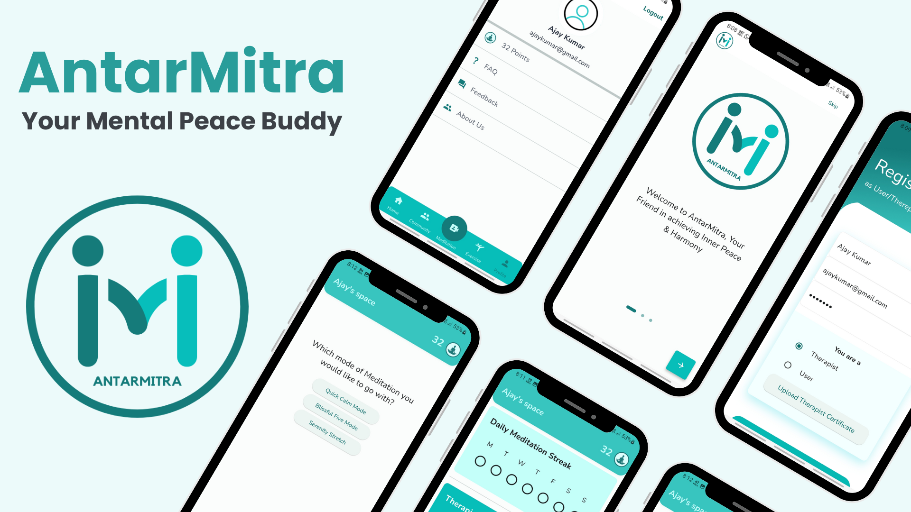

 # AntarMitra - Meditation and SelfCare App  
 
AntarMitra is a meditation and self-care app crafted with Flutter, Dart, Firebase, and GetX. It hosts a community feed where users find support from Therapists. It has integrated guided video meditations to facilitate users in establishing regular mindfulness routines. A dynamic reward system further encourages user engagement and commitment to their mental well-being journey.

